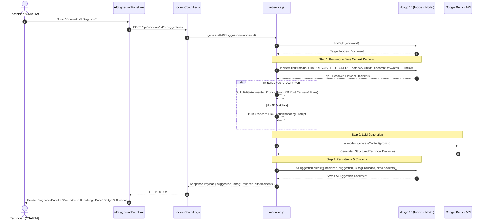

# System Design: FEAT-023 — RAG-Enhanced AI Troubleshooting via Knowledge Base

**Feature ID**: FEAT-023  
**Feature Name**: RAG-Enhanced AI Diagnostics System Architecture  

---

## 1. System Architecture & Component Diagram

```
+------------------------+             +------------------------+             +------------------------+
|   Vue 3 Frontend       |             |  Express API Server    |             |  MongoDB Database      |
|                        |             |                        |             |                        |
| AISuggestionPanel.vue  | --(POST)--> | incidentController.js  |             |  incidents Collection  |
|                        |             |                        |             |  (Text Index & Filter) |
| - Grounded Badge       |             |  aiService.js          | --(Query)-> |  status: RESOLVED/CLOSED|
| - Cited KB Tickets     | <-- (JSON)- |  - RAG Retriever       | <-- (Docs)- |                        |
+------------------------+             |  - Prompt Builder      |             +------------------------+
                                       |  - Gemini 2.5 API      |
                                       +------------------------+
                                                   |
                                            (Gemini Request)
                                                   v
                                       +------------------------+
                                       | Google Gemini AI API   |
                                       | (gemini-2.5-flash)     |
                                       +------------------------+
```

---

## 2. RAG Sequence Diagram



---

## 3. RAG Prompt Construction Template

When Knowledge Base records are retrieved, the prompt builder in `aiService.js` formats the prompt as follows:

```text
You are an expert FIRST Robotics Competition (FRC) Control System Advisor (CSA) and Technical Advisor (FTA).

[VERIFIED KNOWLEDGE BASE COMPETITION RESOLUTIONS]
The following verified resolutions were recorded for similar incidents at past FRC events:
1. Team {teamNumber} (Match {matchNumber}) [{category}]:
   - Issue: {description}
   - Root Cause: {rootCause}
   - Applied Fix: {appliedSolution}

2. Team {teamNumber} (Match {matchNumber}) [{category}]:
   - Issue: {description}
   - Root Cause: {rootCause}
   - Applied Fix: {appliedSolution}

[CURRENT INCIDENT TO DIAGNOSE]
Team: {targetTeamNumber}
Match: {targetMatchNumber}
Category: {targetCategory}
Priority: {targetPriority}
Description: {targetDescription}

INSTRUCTIONS:
1. Analyze the current incident using both general FRC engineering knowledge and the provided verified Knowledge Base resolutions.
2. If the verified Knowledge Base resolutions apply, directly cite them (e.g., "Based on a similar issue resolved for Team 254 (Match Q12)...").
3. Provide a structured response formatted with:
   - **Probable Root Cause**: Clear technical cause.
   - **Recommended Action Steps**: Step-by-step physical/code checks for pit crew.
```

---

## 4. Data Schemas

### AISuggestion Document Extension (`backend/src/models/AISuggestion.js`)

```javascript
import mongoose from 'mongoose';

const aiSuggestionSchema = new mongoose.Schema({
  incidentId: { type: mongoose.Schema.Types.ObjectId, ref: 'Incident', required: true, index: true },
  suggestion: { type: String, required: true },
  isRagGrounded: { type: Boolean, default: false },
  citedIncidents: [{
    incidentId: { type: mongoose.Schema.Types.ObjectId, ref: 'Incident' },
    teamNumber: Number,
    matchNumber: String,
    category: String,
    appliedSolution: String
  }],
  rating: { type: String, enum: ['HELPFUL', 'NEUTRAL', 'UNHELPFUL'], default: null },
  feedback: { type: String, default: null }
}, { timestamps: true });

export const AISuggestion = mongoose.model('AISuggestion', aiSuggestionSchema);
```
